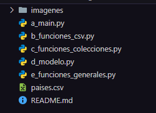
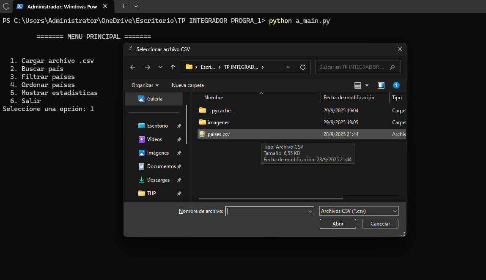
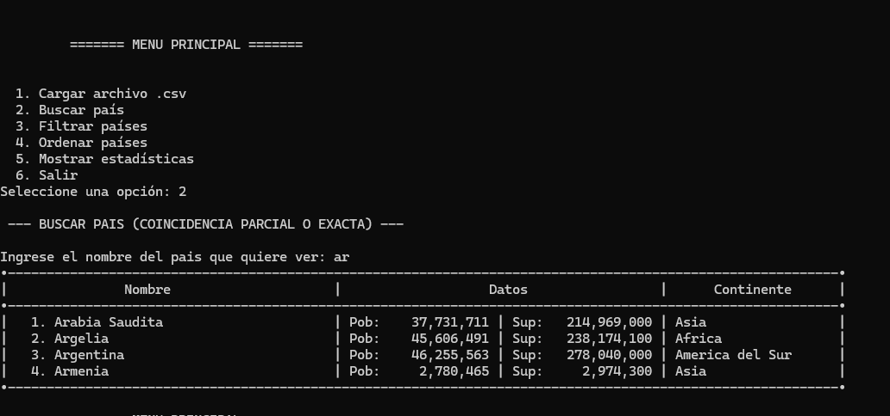
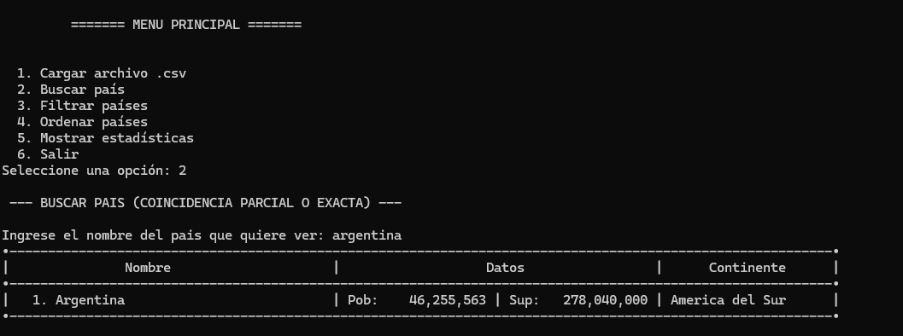
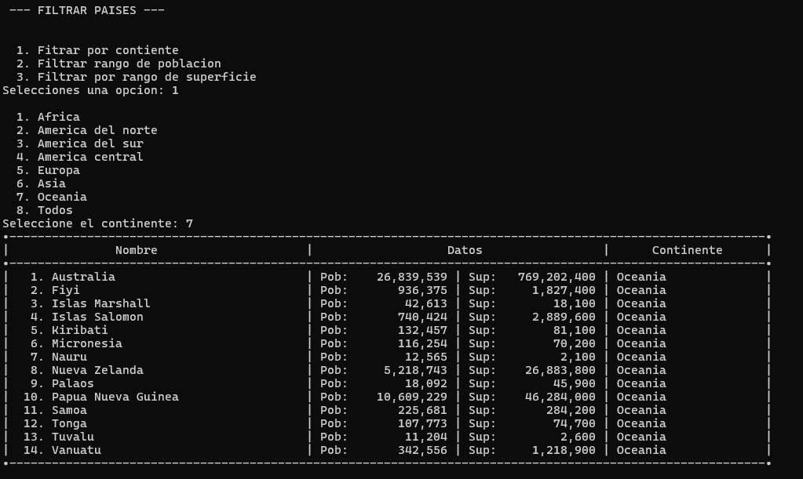

# 🌍 Gestión de Países en Python

Trabajo Práctico Integrador – Programación 1  
Tecnicatura Universitaria en Programación
## 👥 Integrantes
- `Adrian Gonzalez` Comisión 6
- `Ezequiel Taboada`  Comisión 13

## 📌 Descripción
Aplicación en **Python 3.13** que permite gestionar información de países a partir de un archivo **CSV**.  
Incluye funcionalidades de búsqueda, filtrado, ordenamiento y estadísticas.

## 🚀 Funcionalidades
- Carga de archivo mediante interfaz grafica o la creacion de uno nuevo.
- Buscar países por nombre (coincidencia parcial o exacta).  
- Filtrar países por:
  - Continente  
  - Rango de población  
  - Rango de superficie  
- Ordenar países por:
  - Nombre  
  - Población  
  - Superficie  
- Mostrar estadísticas:
  - País con mayor y menor población
  - País con mayor y menor superficie
  - Promedio de población por continente y global  
  - Promedio de superficie por continente y global 
  - Cantidad de países por continente y global

#### 🖊️ Modificaciones
- Se incorporó agregar países
- Se incorporó actualizar superficie y/o población
- Se incorporó elimiar un país
- Se permite trabajar con nuevos archivos
## 📂 Estructura del proyecto




## ⚙️ Requisitos
- Python 3.x

## ▶️ Ejecución
1. Clonar el repositorio o descargar los archivos.  
2. Ubicar el dataset `paises.csv` en la carpeta raíz.  
3. Ejecutar el programa:  

```bash
python a_main.py
```

## 📸 Ejemplo de uso

###  Carga de archivo CSV


### Ejemplo búsqueda parcial


### Ejemplo búsqueda exacta


### Ejemplo filtrar por continente



## 📦 Dependencias

Este proyecto utiliza únicamente librerías estándar de Python (no requiere instalación adicional):

- **csv**  
  Proporciona funcionalidades para leer y escribir archivos en formato CSV.  
  En este proyecto se usa `csv.DictReader` para convertir cada fila del archivo en un diccionario.

- **tkinter**  
  Librería estándar para crear interfaces gráficas (GUI).  
  Se utiliza únicamente para abrir un cuadro de diálogo de selección de archivos.

- **tkinter.filedialog**  
  Submódulo de `tkinter` que permite al usuario elegir archivos desde el sistema.  
  En este proyecto se usa `filedialog.askopenfilename()` para seleccionar el archivo CSV a procesar.

## 📚 Bibliografía
- [Tutorial oficial de Python en español — Información oficial de Python](https://docs.python.org/es/3/tutorial/index.html)
- [Principiantes de Python — Archivos CSV: Lectura y escritura de archivos CSV](https://python-adv-web-apps.readthedocs.io/en/latest/csv.html)  
- [Keepcoding — Tkinter: Interfaz gráfica de usuario](https://keepcoding.io/blog/que-es-tkinter/)  
- [Recursos Python — Examinar archivo o carpeta en Tkinter](https://recursospython.com/guias-y-manuales/examinar-archivo-o-carpeta-en-tk-tkinter/)